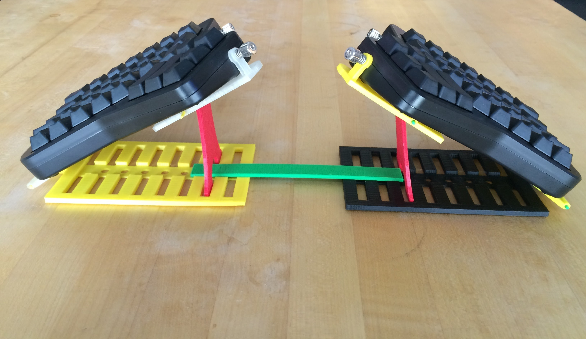
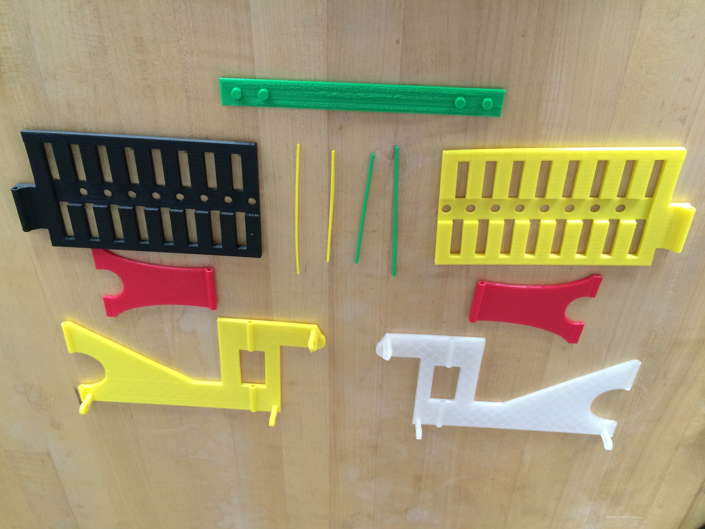

[Thingiverse download link](http://www.thingiverse.com/thing:1433117)

# Summary

This is a custom keyboard tent git for the [ergodox ez](https://www.indiegogo.com/projects/ergodox-ez-an-incredible-mechanical-keyboard) keyboard. They sell a tent kit with the keyboard but I needed more angle with the keyboard so I designed this.
It is based loosely on the [Freestyle2 ascent keyboard tent kit](http://www.kinesis-ergo.com/shop/freestyle2-ascent-accessory/) but with changes to make the design more printer friendly.

# Print Settings

Printer Brand: MakerBot
Printer: MakerBot Replicator (5th Generation)
Rafts: Yes
Supports: No
Resolution: .2 mm

Notes: 
The base parts and stands can be printed in .3 mm but I kept having issues with the hinges when printing the keyboard mounts at the larger resolution.

# Post-Printing

## Keyboard moves/slides while typing

I have had some issues with the tent kit sliding on my desk. I have a smooth surface on my desk and ended up putting double sided tape under the bottom plates to hold it in place better. It isn't a problem for me when I use an [XTrackPad](http://www.amazon.com/XTracPads-Ripper-XXL-Desktop-Gaming/dp/B000HTDBWI) but YMMV depending on your desk surface.

## Hinge pieces don't fit

I printed 2 sets of hinge pins (1.75mm and 1.25mm). It depends on what resolution you print your other parts and how well the prints turned out. I didn't have to file the hinges at all but I cut the extra length off the pins so they wouldn't stick out. It may also be good to put a dab of hot glue on the end to keep the pin in but I haven't had a problem yet.

## Forks

Some people have created alternatives based on this design.
If you know of one please PR it here.
I love to see them

- [Moonlander alternative](https://www.thingiverse.com/thing:5028257)
